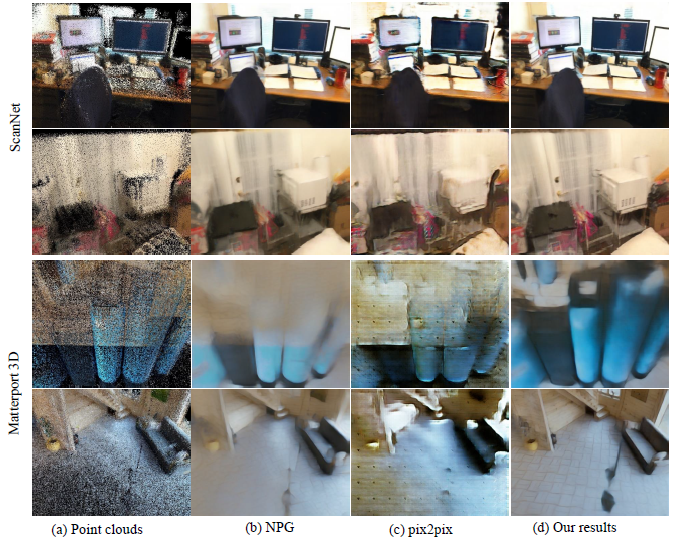

# NeuralPointCloudRendering

**Neural Point Cloud Rendering via Multi-Plane projection** (CVPR 2020)  
Peng Dai*, [Yinda Zhang*](https://www.zhangyinda.com/), [Zhuwen Li*](https://scholar.google.com/citations?user=gIBLutQAAAAJ&hl=en), [Shuaicheng Liu](http://www.liushuaicheng.org/), [Bing Zeng](https://scholar.google.com/citations?user=s-kUGYQAAAAJ&hl=en).
 In [ArXiv](https://arxiv.org/abs/1912.04645.pdf), 2020.

## Framework

 
Our method is divided into two parts, the multi-plane based voxelization (left) and multi-plane rendering(right). For the first part, point clouds are re-projected into camera coordinate system to form frustum region and voxelization plus aggregation operations are adopted to generate a multi-plane 3D representation, which will be concatenated with normalized view direction and sent to render network. For the second part, the concatenated input is feed into a 3D neural render network to predict the product with 4 channels (i.e. RGB + blend weight) and the final output is generated by blending all planes. The training process is under the supervision of perceptual loss, and both network parameters and point clouds features are optimized according to the gradient.

## Results

 Some test results on [ScanNet](https://github.com/ScanNet/ScanNet) and [Matterport 3D](https://github.com/niessner/Matterport) datasets.

## Video

## Code coming soon!

## Datasets
