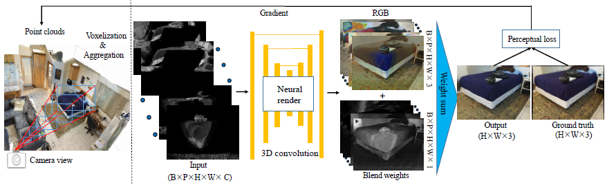

# NeuralPointCloudRendering

**Neural Point Cloud Rendering via Multi-Plane projection** (CVPR 2020)  
Peng Dai*, [Yinda Zhang*](https://www.zhangyinda.com/), [Zhuwen Li*](https://scholar.google.com/citations?user=gIBLutQAAAAJ&hl=en), [Shuaicheng Liu](http://www.liushuaicheng.org/), [Bing Zeng](https://scholar.google.com/citations?user=s-kUGYQAAAAJ&hl=en).
<br>In [CVPR](https://arxiv.org/abs/1912.04645.pdf), 2020.

## Introduction

<br>
Our method is divided into two parts, the multi-plane based voxelization (left) and multi-plane rendering(right). For the first part, point clouds are re-projected into camera coordinate system to form frustum region and voxelization plus aggregation operations are adopted to generate a multi-plane 3D representation, which will be concatenated with normalized view direction and sent to render network. For the second part, the concatenated input is feed into a 3D neural render network to predict the product with 4 channels (i.e. RGB + blend weight) and the final output is generated by blending all planes. The training process is under the supervision of perceptual loss, and both network parameters and point clouds features are optimized according to the gradient.

## Environments
Tensorflow 1.10.0
<br>
Python 3.6
<br>
OpenCV

## Data downloads
Download datasets(i.e. ScanNet and Matterport 3D) into corresponding 'data/...' folders, including RGB_D images, camera parameters.

## Preprocessing
Before training, there are several steps required. And pre-processing results will be stored in 'pre_processing_results/xxx'.

### Point clouds generation
Generate point clouds files('point_clouds.ply') from registrated RGB-D images by running ```python pre_processing/generate_pointclouds_xxx.py ```. Before that, you need to specific which scene (i.e. 'scene = scene_name') you want to deal with in 'generate_pointclouds_xxx.py'.

### Point clouds simplification
Based on generated point cloud files, we provide ``` python pre_processing/pointclouds_simplification.py``` for point cloud simplification, results will be saved in 'point_clouds_simplified.ply'. Also, you need to specific the 'point_clouds.ply' file from which dataset and scene (i.e. 'scene = dataset/scene_name') in 'pointclouds_simplification.py'.

### Voxelization and Aggregation
In order to save training time, we voxelize and aggregate point clouds in advance by running ```python pre_processing/voxelization_aggregation_xxx.py```. This will pre-compute and save voxelizaion and aggregation information for each camera (saved in 'reproject_results_xx/' and 'weight_xx/' respectively). Also you need to specific the scene (i.e. 'scene = scene_name') in 'voxelization_aggregation_xxx.py'. 

## Train
Download ['imagenet-vgg-verydeep-19.mat']() into 'VGG_model/'.
<br>
<br>
To train the model, just run ```python npcr_ScanNet.py``` for ScanNet and ```python npcr_Matterport3D.py``` for Matterport3D. You need to set 'is_training=True' and specific the dataset and scene name (i.e. 'dataset = dataset_name', 'scene = scene_name') in 'npcr_xxx.py', and the output_path is 'xxx(dataset_name)_npcr_xxx(scene_name)'.
<br>

## Test
To test the model, you need to set 'is_training=False' and specific dataset and scene name. Then, run ```python npcr_ScanNet.py``` for ScanNet and ```python npcr_Matterport3D.py``` for Matterport3D. And the test results will be saved in 'xxx(output_path)/Test_Result/'.

If you need the point cloud files and pretrained models, please email me(daipengwa@gmail.com) and show licenses of [ScanNet](https://github.com/ScanNet/ScanNet) and [Matterport3D](https://github.com/niessner/Matterport).

## Citation
If you use our code or method in your work, please cite the following:
```
@InProceedings{Dai_2019_neuralpointcloudrendering,
author = {Peng, Dai and Yinda, Zhang and Zhuwen, Li and Shuaicheng, Liu and Bing, Zeng},
title = {Neural Point Cloud Rendering via Multi-plane Projection},
booktitle = {The IEEE Conference on Computer Vision and Pattern Recognition (CVPR)},
month = {June},
year = {2020}
}

